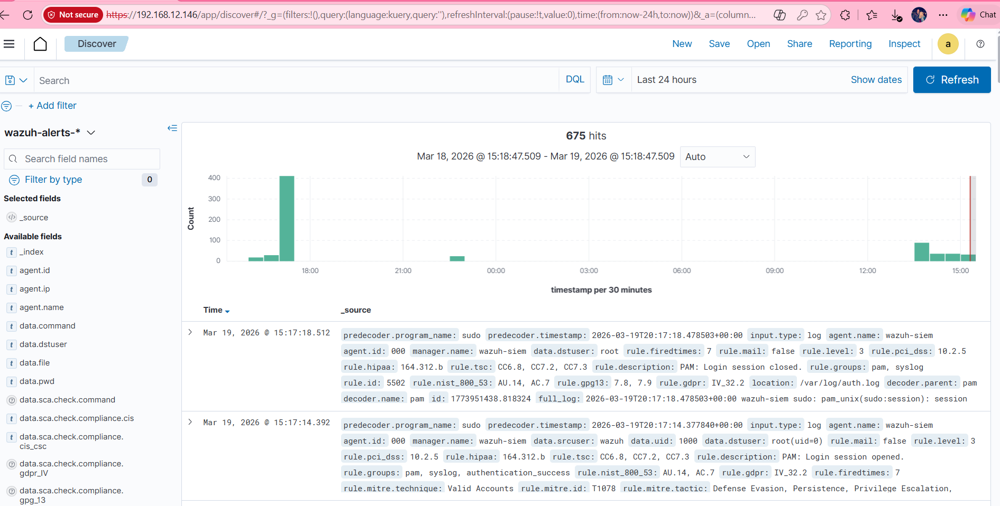
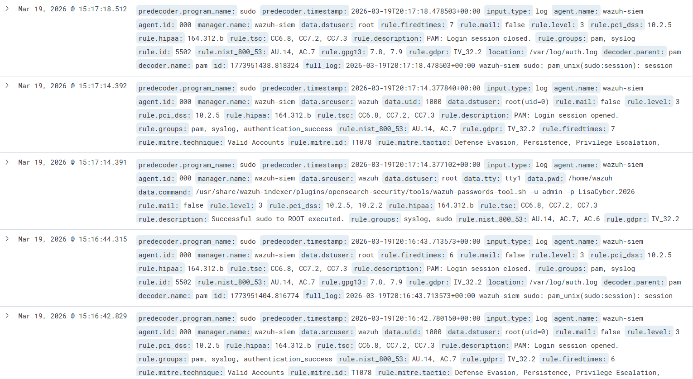
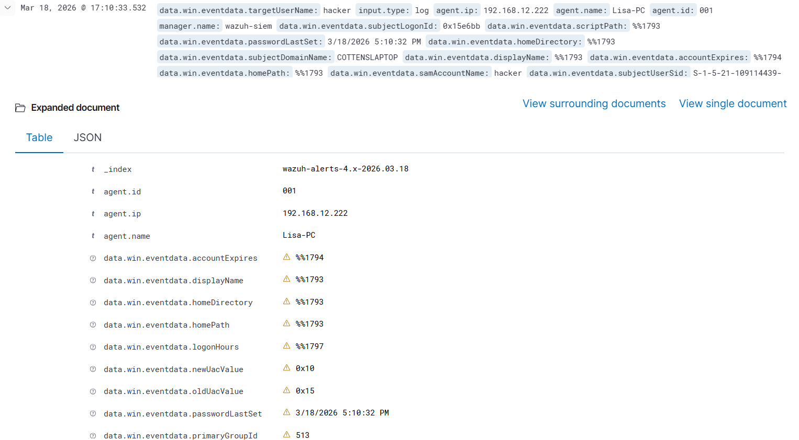
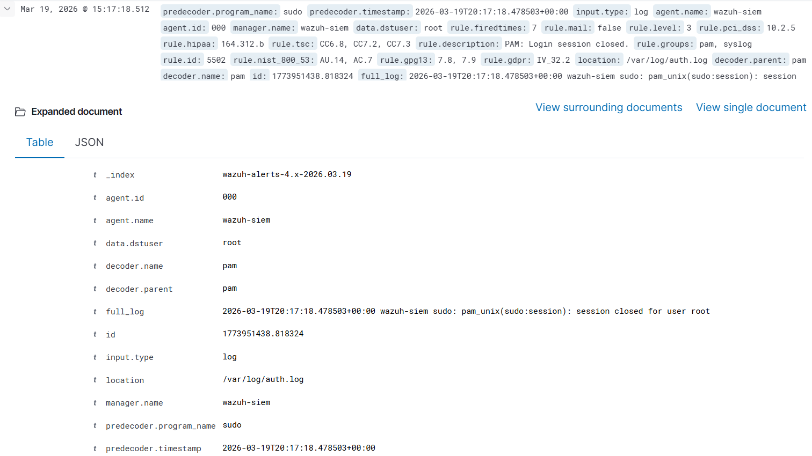
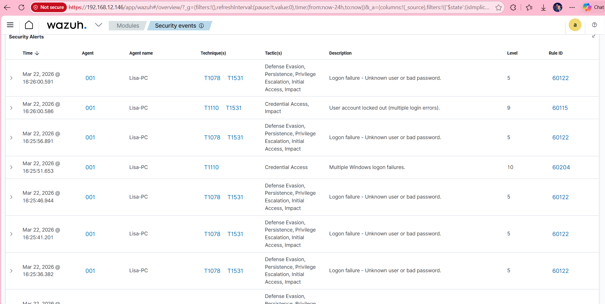

# Wazuh SIEM Home Lab
Hands-on SOC lab using Wazuh to simulate and analyze real-world security events including brute force attacks, alert triage and log analysis.
![Wazuh Dashboard]

## Overview
Built a cybersecurity home lab using Wazuh SIEM to monitor and analyze security events from a Windows endpoint. 

## Environment
- Ubuntu Server (VirtualBox)
- Wazuh SIEM
- Windows 11 endpoint (agent installed)

## What I Did
- Installed and configured Wazuh SIEM
- Connected Windows agent to SIEM
- Simulated attacks:
  - Unauthorized user creation
  - Privilege escalation
  - Failed login attempts

## Detection & Analysis
- Observed alerts in Wazuh dashboard
- Investigated logs using Discover
- Identified suspicious activity

## Skills Gained
- SIEM (Wazuh)
- Log analysis
- Threat detection
- Linux basics
- Networking

## Outcome
Successfully built and operated a SIEM lab capable of detecting and analyzing real-time security events.

## Screenshots

### Dashboard (Agent Status)

### Linux Logs (Wazuh Server Activity)

### Windows Event – User Creation (Detection)

### Log Analysis (Discover)

##  Brute Force Attack Detection

### Overview
Simulated a brute force attack by generating repeated failed login attempts on a Windows 11 endpoint.

### Attack Simulation
Used the `runas` command with incorrect credentials multiple times, triggering authentication failures and account lockout.

### Detection in Wazuh
Wazuh SIEM successfully detected:
- Multiple failed login attempts
- Rapid authentication failures
- Account lockout event

### Evidence

### MITRE ATT&CK Mapping
- T1110 – Brute Force
- T1078 – Valid Accounts

### Outcome
Demonstrated ability to detect brute force attack patterns using SIEM analysis and event correlation.

## SOC Alert Triage Lab

Investigated security alerts generated by Wazuh SIEM and performed triage on failed login attempts.

🔗 [View SOC Alert Triage Lab](soc-alert-triage.md)
