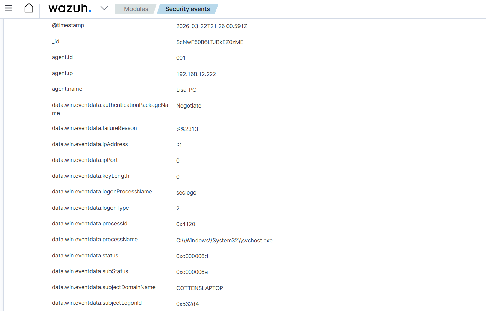

# SOC Alert Triage Lab (Wazuh SIEM)

## Alert Summary
Investigated a security alert generated by Wazuh SIEM related to multiple failed login attempts on a Windows 11 endpoint.

## Alert Details
- Source: Lisa-PC
- IP Address: 192.168.12.222
- Event: Failed login attempt
- Logon Type: 2 (Interactive login)
- Process: svchost.exe
- Status: 0xC000006D (Login failure)
- SubStatus: 0xC000006A (Incorrect password)
- Technique: T1110 (Brute Force)

## Investigation
Analyzed Windows authentication logs in Wazuh SIEM.

Findings:
- Multiple failed login attempts occurred within a short timeframe
- Status code 0xC000006D indicates authentication failure
- SubStatus 0xC000006A confirms incorrect password usage
- Logon type 2 shows interactive login attempts on the local machine
- Activity resulted in account lockout after repeated failures

This behavior is consistent with a brute force attack pattern.

## Analysis
The alert is classified as a True Positive.

The activity was intentionally generated in a controlled lab environment using repeated incorrect login attempts.

## Conclusion
- Confirmed brute force attack simulation
- Successfully detected by Wazuh SIEM
- Matches MITRE ATT&CK technique T1110

## Recommendation
- Enforce account lockout policies
- Monitor repeated login failures
- Implement alert thresholds for brute force detection

## Evidence
Wazuh SIEM alert details showing failed login attempt investigation:

The alert indiccates multiple failed login attempts consistent with brute force activity originating from the monitored endpoint.
